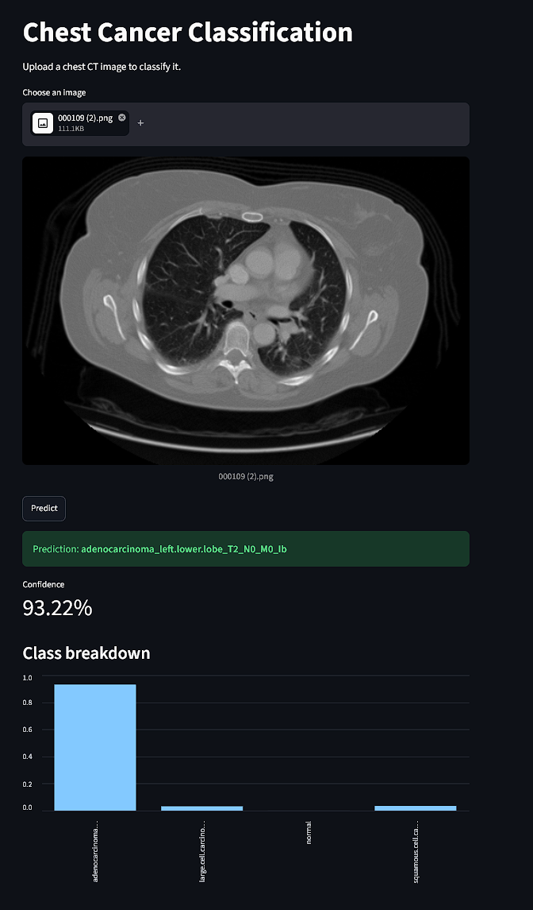
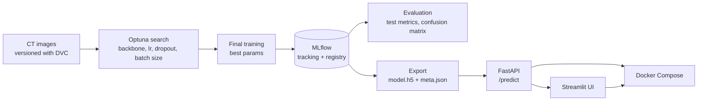
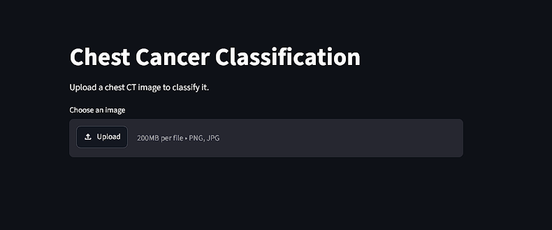
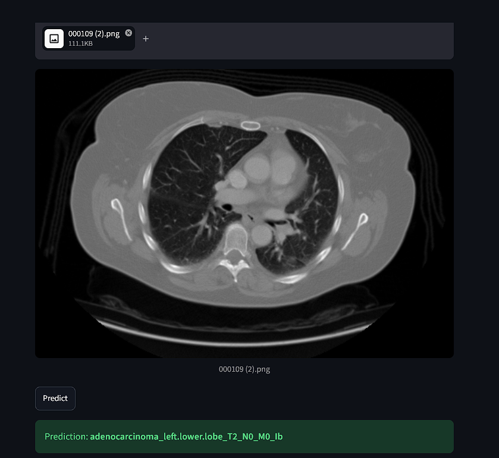
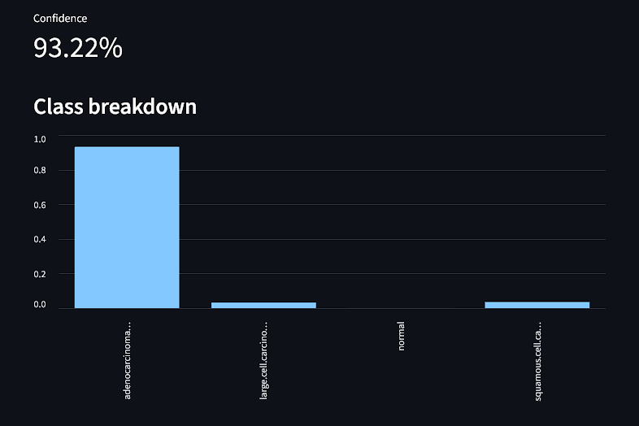

# Chest Cancer Classification — End-to-End MLOps Pipeline

[](https://github.com/KhattabHimself/chest-cancer-classification/actions/workflows/ci-cd.yml)

Classifies chest CT scans into four classes (adenocarcinoma, large cell carcinoma, squamous cell carcinoma, normal) with a transfer-learning CNN, and wraps it in a full MLOps workflow: versioned data, hyperparameter search, experiment tracking, a model registry, a REST API, a web UI, and Docker deployment.

> The focus of this project is the **pipeline**, not state-of-the-art accuracy. Every stage is reproducible, tracked, and deployable.

<p align="center">
  
</p>

## Pipeline



## Tech stack

| Area | Tools |
|---|---|
| Modeling | TensorFlow / Keras 2.15, MobileNetV2 & EfficientNetB0 (ImageNet weights) |
| Hyperparameter tuning | Optuna |
| Experiment tracking & registry | MLflow (SQLite backend) |
| Data versioning | DVC |
| Serving | FastAPI, Uvicorn |
| UI | Streamlit |
| Deployment | Docker, Docker Compose |
| Testing | pytest |

## Results

Registered model `chest-cancer-classifier` v1 (MobileNetV2 backbone, 224×224 input):

| Metric | Test set |
|---|---|
| Accuracy | **73.97%** |
| Loss | 0.672 |

The confusion matrix is saved to `reports/figures/confusion_matrix.png` and logged to MLflow with each evaluation run.

## Dataset

[Chest CT-Scan Images](https://www.kaggle.com/datasets/mohamedhanyyy/chest-ctscan-images) (Kaggle): 1,000 CT images already split into `train/`, `valid/` and `test/`, one folder per class. The `data/` folder is tracked with DVC (`data.dvc`), not Git.

## Project structure

```
├── configs/config.yaml         # paths, MLflow URI, experiment + registered model names
├── params.yaml                 # training defaults and Optuna search space
├── data.dvc                    # DVC pointer to the dataset
├── src/
│   ├── features/preprocessing.py   # data generators + per-backbone preprocessing
│   ├── training/train.py           # model definition, training, registration
│   ├── training/tune.py            # Optuna search → trains + registers the best model
│   ├── evaluation/evaluation.py    # test metrics, confusion matrix, MLflow logging
│   ├── inference/predict.py        # Predictor class (loads model once, predicts per image)
│   ├── inference/export_model.py   # exports a registry version for deployment
│   ├── inference/api.py            # FastAPI app: /health, /predict
│   ├── ui/app.py                   # Streamlit front end
│   └── utils/common.py             # config loading, MLflow setup, logging
├── docker/
│   ├── api.Dockerfile
│   └── ui.Dockerfile
├── docker-compose.yaml
├── tests/                      # pytest suite
├── requirements.txt            # full dev environment
├── requirements-api.txt        # API image only
└── requirements-ui.txt         # UI image only
```

## Getting started

### 1. Set up the environment

Python 3.10 is required (TensorFlow 2.15 supports 3.9–3.11).

```bash
git clone https://github.com/KhattabHimself/chest-cancer-classification.git
cd chest-cancer-classification

conda create -n chest_ct python=3.10 -y
conda activate chest_ct
pip install -r requirements.txt
```

### 2. Get the data

Download the dataset from Kaggle and extract it so the folders are `data/train`, `data/valid` and `data/test`. If you have access to a configured DVC remote, run `dvc pull` instead.

Run every command below from the project root.

### 3. Tune, train and register

```bash
python -m src.training.tune
```

This runs an Optuna search over the backbone, learning rate, dropout and batch size. Each trial is logged as a nested MLflow run. The best configuration is then retrained and registered as `chest-cancer-classifier`.

### 4. Evaluate

```bash
python -m src.evaluation.evaluation
```

This writes `reports/metrics.json` and `reports/figures/confusion_matrix.png`, and logs both to MLflow.

### 5. Explore the experiments

```bash
mlflow ui --backend-store-uri sqlite:///mlflow.db
```

Open http://localhost:5000 to compare runs and see the registered model versions.

## Serving

### Run locally

```bash
# terminal 1 — API
uvicorn src.inference.api:app --reload

# terminal 2 — UI
streamlit run src/ui/app.py
```

- API docs: http://localhost:8000/docs
- UI: http://localhost:8501

### Run with Docker

```bash
# 1. export the registered model so the image doesn't depend on the MLflow database
python -m src.inference.export_model

# 2. build and start both services
docker compose up --build
```

| Service | URL |
|---|---|
| UI | http://localhost:8501 |
| API | http://localhost:8000 (docs at `/docs`) |

The UI waits for the API's health check to pass before starting, so the model is loaded before the first request arrives. Stop everything with `docker compose down`.

### Web UI

Upload a CT image, click **Predict**, and the UI sends it to the API and shows the predicted class, its confidence and the probability of every class.

| 1. Upload | 2. Prediction | 3. Class breakdown |
|---|---|---|
|  |  |  |

### API

```bash
curl -X POST http://localhost:8000/predict -F "file=@path/to/ct_scan.png"
```

```json
{
  "filename": "ct_scan.png",
  "prediction": "normal",
  "confidence": 0.9999,
  "class_breakdown": {
    "adenocarcinoma_left.lower.lobe_T2_N0_M0_Ib": 0.00001,
    "large.cell.carcinoma_left.hilum_T2_N2_M0_IIIa": 0.0000002,
    "normal": 0.9999,
    "squamous.cell.carcinoma_left.hilum_T1_N2_M0_IIIa": 0.00006
  }
}
```

## Testing

```bash
pytest
```

## Design decisions

- **Preprocessing follows the model.** MobileNetV2 and EfficientNet expect different input scaling. The backbone is logged as a run parameter, and inference reads it from the model's metadata, so the API always applies the preprocessing the model was trained with.
- **The deployed model is exported, not read from the MLflow registry.** MLflow's SQLite store records artifact locations as absolute host paths (e.g. `C:/Users/...`), which don't exist inside a Linux container. `export_model.py` writes the model and its metadata (backbone, image size, class names, source run ID) to `models/production/`, and the image copies that folder in. The source run ID keeps the deployed model traceable back to MLflow.
- **The model is exported as HDF5 (`.h5`).** Keras 2.15 on Windows writes `.keras` weight paths with backslashes, which then fail to load on Linux.
- **The model is loaded once, at API startup** (FastAPI lifespan), not on every request.
- **Configuration comes from the environment.** The UI reads `API_URL` from an environment variable, so the same code works locally (`localhost`) and in Compose (`http://api:8000`).
- **Each service has its own image.** The API image uses `tensorflow-cpu` and the UI image contains only Streamlit, which keeps both images small.

## Future work

- **Bake preprocessing into the model graph**, so the saved model takes raw pixels and train/serve skew becomes impossible.
- **Add a DVC pipeline** (`dvc.yaml`) chaining tuning → training → evaluation → export, so `dvc repro` reruns only what changed.
- **Use a model alias** (e.g. `@champion`) instead of a hardcoded version number.
- **Add CI/CD** with GitHub Actions to run tests and build and push images.
- **Add monitoring:** log predictions and track data drift with Evidently.

## Disclaimer

This is an educational project. It is **not** a medical device and must not be used for diagnosis.
